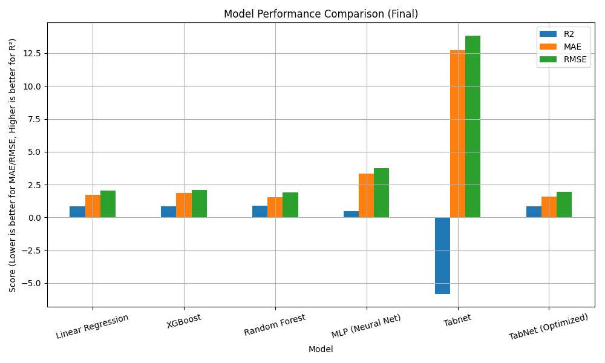

# 🧬 iPSC Differentiation Outcome Predictor

This project simulates and models the process of differentiating induced pluripotent stem cells (iPSCs) into specific cell types under various experimental protocols. It aims to **predict quality metrics** like **Purity, Viability, and Yield** using cytokine levels, oxygen concentration, seeding density, and gene expression markers.

---

## 📁 Project Structure

| File | Purpose |
|------|---------|
| `01_data_generation.ipynb` | Simulates biologically inspired dataset for iPSC differentiation |
| `02_eda.ipynb` | Performs EDA: nulls, ranges, distributions, correlation matrix |
| `03_modeling.ipynb` | Builds and compares ML models |
| `app.py` | Streamlit app for interactive prediction |
| `models/` | Saved ML models |
| `data/` | Raw and cleaned data |
| `README.md` | Project overview and insight |
| `.gitignore` | Excludes virtualenv, system files from version control |

---

## 🧠 Project Summary

- Simulated data for 120 iPSC differentiation experiments
- Features: cytokine levels, culture conditions, gene expression
- Target: Predicting **Purity** (0–100%)
- Applied multiple machine learning models:
  - Linear Regression
  - XGBoost
  - Random Forest
  - MLP Neural Network
  - TabNet (deep learning model for tabular data)

---

## 📊 Final Model Comparison

| Model              | R²     | MAE    | RMSE   |
|-------------------|--------|--------|--------|
| Linear Regression | 0.8491 | 1.7373 | 2.0581 |
| XGBoost           | 0.8438 | 1.8502 | 2.0940 |
| Random Forest     | **0.8718** | **1.5575** | **1.8968** |
| MLP (Neural Net)  | 0.4996 | 3.3232 | 3.7478 |
| TabNet | -5.832 | 12.7414 | 13.8478 |
| TabNet (Optimized)| 0.8622 | 1.5711 | 1.9670 |

📌 **Random Forest** performed the best overall, with the lowest error and highest R².  
📌 **TabNet**, after tuning, performed very competitively.  
📌 **MLP** underperformed due to the small dataset and scaling sensitivity.

🖼️ 

---

## 🧪 For Non-Technical Readers

Think of this as an AI assistant for stem cell researchers.  
You feed in your experiment settings — like how much BMP4 to use or what oxygen level — and it predicts how successful your cell conversion will be.

It’s like a recipe predictor: tweak the ingredients, see how good the dish might turn out!

---

## 🖥️ Interactive App

You can try different protocol settings in the interactive dashboard:

> Run: `streamlit run app.py`

Or open the file directly to test model predictions on custom input.

---

## 🔭 Future Additions

- SHAP explainability (Why the model predicts what it does)
- Add tabs for Viability & Yield prediction
- Deploy app online via Streamlit Cloud or Hugging Face Spaces

---

## 📜 License

MIT License — free to use with attribution.
